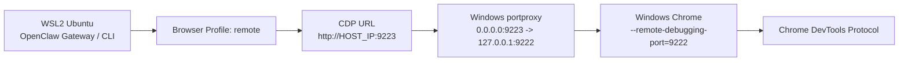

# 🧩 wsl2-windows-chrome-remote-cdp

> **OpenClaw skill for controlling Windows Chrome from WSL2 via Remote CDP**  
> **面向 WSL2 + Windows Chrome + OpenClaw 的远程 CDP 控制技能**


---

## 🇨🇳 中文简介

这是一个给 **OpenClaw** 使用的技能仓库，解决的是下面这类真实环境问题：

- OpenClaw Gateway 跑在 **WSL2 Ubuntu** 里
- 真正要控制的浏览器是 **Windows 上的 Chrome**
- 本地环境还可能叠加：
  - 代理软件
  - 全局模式
  - 虚拟网卡
  - WSL / Windows 分离网络栈

这个技能把可用链路沉淀成了：

- WSL 侧恢复脚本
- Windows 侧 setup / teardown / self-check
- Mermaid 架构图
- dry-run 检查流程
- 面向小白的执行引导
- 真机踩坑后的排障经验

---

## 🇺🇸 English Overview

This repository contains an **OpenClaw skill** for a real-world split-host browser control scenario:

- OpenClaw Gateway runs inside **WSL2 Ubuntu**
- The actual browser to control is **Google Chrome on Windows**
- The environment may also include:
  - proxy software
  - global proxy mode
  - virtual network adapters
  - split WSL / Windows networking behavior

The skill turns that into a repeatable workflow with:

- WSL-side recovery scripts
- Windows-side setup / teardown / self-check
- Mermaid architecture diagrams
- dry-run flow before mutation
- novice-friendly execution guidance
- troubleshooting notes learned from real debugging

---

## ✨ Key Features / 核心能力

- 🐧 **WSL-side recovery**: refresh OpenClaw remote CDP profile automatically
- 🪟 **Windows-side setup**: create `portproxy` + firewall + Chrome debug port workflow
- 🔍 **Windows self-check**: verify local CDP / bridge / firewall state
- 🧪 **Dry-run support**: preview Windows setup/teardown commands before mutation
- 🧭 **Dual-terminal guidance**: explicitly separates WSL Terminal and Windows PowerShell steps
- 🧯 **Troubleshooting-first design**: optimized for environments with proxy/global-mode/virtual-NIC complexity

---

## 🏗️ Architecture / 架构图



---

## 📦 Repository Layout / 仓库结构

```text
repo-root/
├── README.md
└── skill-wsl2-windows-chrome-remote-cdp/
    ├── SKILL.md
    ├── references/
    │   ├── runbook.md
    │   ├── config-snippets.md
    │   └── troubleshooting.md
    └── scripts/
        ├── self-check.sh
        ├── show-openclaw-remote-cdp.sh
        ├── update-openclaw-remote-cdp.sh
        ├── windows-self-check.ps1
        ├── setup-windows-chrome-cdp.ps1
        └── teardown-windows-chrome-cdp.ps1
```

### Why this layout? / 为什么这样组织？

**中文：**
- `README.md` 给人看
- `SKILL.md` 给 OpenClaw / Agent 触发和执行
- 把 skill 放进 `skill-.../` 子目录后，避免 README 和 SKILL 混在一起，减少误读和误加载风险

**English:**
- `README.md` is for humans
- `SKILL.md` is for OpenClaw / agents
- placing the skill under a dedicated `skill-.../` directory reduces accidental mixing between human docs and agent instructions

---

## 🚀 Quick Start / 快速开始

### 1) WSL side / WSL 侧

Enter the skill directory / 进入 skill 目录：

```bash
cd skill-wsl2-windows-chrome-remote-cdp
```

Run preflight / 先跑前置检查：

```bash
bash ./scripts/self-check.sh
```

Refresh remote profile / 刷新 remote 配置：

```bash
bash ./scripts/update-openclaw-remote-cdp.sh --dry-run
bash ./scripts/update-openclaw-remote-cdp.sh --apply --set-default
```

---

### 2) Windows side / Windows 侧

> Recommended: copy `.ps1` files to a local Windows folder first.  
> 建议先把 `.ps1` 文件复制到 Windows 本地目录再执行。

Run self-check / 先做自检：

```powershell
powershell -NoExit -ExecutionPolicy Bypass -File .\windows-self-check.ps1
```

Preview setup / 先 dry-run 看 setup 会做什么：

```powershell
powershell -ExecutionPolicy Bypass -File .\setup-windows-chrome-cdp.ps1 -DryRun
```

Execute setup / 真正执行 setup：

```powershell
powershell -ExecutionPolicy Bypass -File .\setup-windows-chrome-cdp.ps1
```

Preview teardown / 如需回收，先看 teardown dry-run：

```powershell
powershell -ExecutionPolicy Bypass -File .\teardown-windows-chrome-cdp.ps1 -DryRun
```

---

## ✅ Verification Targets / 验证目标

A healthy environment should eventually confirm / 一个健康环境最终应满足：

- Chrome executable exists / Chrome 路径存在
- `127.0.0.1:9222/json/version` reachable
- `127.0.0.1:9222/json/list` reachable
- `portproxy` bridge exists for `9223 -> 127.0.0.1:9222`
- firewall rule exists for `ChromeCDP9223`
- WSL can reach `http://HOST_IP:9223/json/version`
- OpenClaw browser profile `remote` becomes healthy

---

## 🧠 Design Notes / 设计备注

### 中文
- Windows PowerShell 脚本最终采用了**极简、保守、稳定优先**的风格
- 这是经过真实环境反复踩坑后收敛出的结果
- 结论是：**parser stability > elegant abstractions**

### English
- The Windows PowerShell helpers intentionally use a **minimal, parser-stable style**
- This was learned from real debugging iterations
- Final rule: **parser stability > elegant abstractions**

---

## ⚠️ Current Scope / 当前边界

**中文：**
- 当前仓库重点是“让链路跑通并可恢复”
- 不是通用浏览器自动化框架
- 对 Windows 侧，优先保证“能跑、能查、能恢复”，而不是脚本写法漂亮

**English:**
- The repository focuses on making the chain work and recover reliably
- It is not a general browser automation framework
- On the Windows side, operational stability takes precedence over elegant scripting

---

## 🔖 Installation Hint / 安装提示

If OpenClaw installs skills from a folder path, point it to:

```text
skill-wsl2-windows-chrome-remote-cdp/
```

如果 OpenClaw 支持按目录安装 skill，请直接指向：

```text
skill-wsl2-windows-chrome-remote-cdp/
```

---

## 📌 Release Status / 发布状态

- Public repository prepared
- `v0.1.0` tag created
- Windows self-check validated through real user feedback loop

---

## 📄 License

No explicit LICENSE file yet. Add one if you want reuse terms to be explicit.
