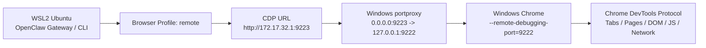
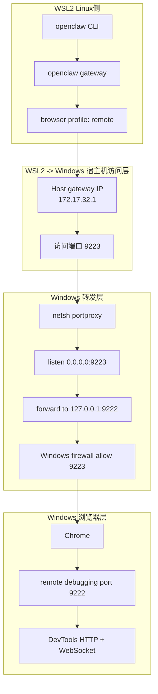
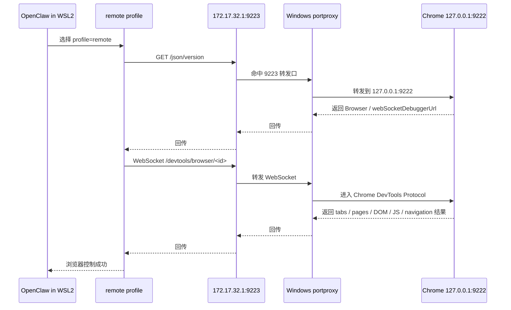

# Runbook

See the packaged executable procedure below.

---

# OpenClaw WSL2 → Windows Chrome Remote CDP Runbook（脱敏版，可执行）

## 1. 目标

本说明用于让其他维护者或 Agent **快速理解、复现并维护**如下工作链路：

- OpenClaw Gateway 运行在 **WSL2 Ubuntu** 中
- 被控制的浏览器运行在 **Windows Chrome** 中
- OpenClaw 不直接控制 Linux 本地浏览器
- OpenClaw 通过 **Remote CDP** 控制 Windows Chrome

本文强调：
- 明确配置
- 明确步骤
- 明确命令
- 明确验证点
- 明确排障顺序

## 2. 最终工作链路（一句话）

```text
OpenClaw (WSL2) -> browser profile: remote -> http://172.17.32.1:9223
-> Windows portproxy -> 127.0.0.1:9222 -> Windows Chrome (CDP)
```

关键固定点：

```text
profile = remote
cdpUrl  = http://172.17.32.1:9223
```

## 3. Mermaid 链路图



## 4. Mermaid 分层结构图



## 5. Mermaid 数据流图



## 6. 关键配置

### 6.1 OpenClaw JSON 配置片段

文件：

```text
~/.openclaw/openclaw.json
```

关键配置片段：

```json
{
  "browser": {
    "enabled": true,
    "defaultProfile": "remote",
    "profiles": {
      "remote": {
        "cdpUrl": "http://172.17.32.1:9223",
        "attachOnly": true,
        "color": "#00AA00"
      }
    }
  }
}
```

## 7. 可执行步骤（按顺序）

### Step 1：在 Windows 启动 Chrome 调试端口 9222

```powershell
& 'C:\Program Files\Google\Chrome\Application\chrome.exe' --remote-debugging-port=9222
```

### Step 2：在 Windows 本机确认 9222 确实可用

```powershell
curl http://127.0.0.1:9222/json/version
curl http://127.0.0.1:9222/json/list
netstat -ano | findstr 9222
```

### Step 3：在 Windows 建立 9223 → 9222 的 portproxy 转发

```powershell
netsh interface portproxy add v4tov4 listenaddress=0.0.0.0 listenport=9223 connectaddress=127.0.0.1 connectport=9222
```

查看：

```powershell
netsh interface portproxy show all
```

删除：

```powershell
netsh interface portproxy delete v4tov4 listenaddress=0.0.0.0 listenport=9223
```

### Step 4：在 Windows 放行 9223 防火墙规则

```powershell
netsh advfirewall firewall add rule name="ChromeCDP9223" dir=in action=allow protocol=TCP localport=9223
```

查看：

```powershell
netsh advfirewall firewall show rule name="ChromeCDP9223"
```

删除：

```powershell
netsh advfirewall firewall delete rule name="ChromeCDP9223"
```

### Step 5：在 WSL 验证 9223 是否已打通

```bash
curl --connect-timeout 3 --max-time 5 http://172.17.32.1:9223/json/version
curl --connect-timeout 3 --max-time 5 http://172.17.32.1:9223/json/list
```

### Step 6：重启后自动恢复 remote CDP（推荐）

优先使用 skill 自带脚本，而不是每次手工改 JSON：

```bash
~/bin/update-openclaw-remote-cdp.sh --dry-run
~/bin/update-openclaw-remote-cdp.sh --apply --set-default
```

如果你只是想快速看当前宿主机 IP 与推导出来的 CDP URL：

```bash
~/bin/show-openclaw-remote-cdp.sh
```

建议将 skill 中的脚本复制到：

```bash
mkdir -p ~/bin
cp scripts/update-openclaw-remote-cdp.sh ~/bin/
cp scripts/show-openclaw-remote-cdp.sh ~/bin/
chmod +x ~/bin/update-openclaw-remote-cdp.sh ~/bin/show-openclaw-remote-cdp.sh
```

### Step 7：确认 OpenClaw 配置已指向 remote CDP

```bash
grep -n 'defaultProfile\|cdpUrl\|attachOnly' ~/.openclaw/openclaw.json
```

### Step 8：重启 OpenClaw Gateway

```bash
openclaw gateway restart
```

### Step 9：验证 OpenClaw 已接上 remote profile

```bash
openclaw browser profiles
openclaw browser --browser-profile remote status
```

### Step 10：验证 OpenClaw 对 Windows Chrome 的控制能力

```bash
openclaw browser --browser-profile remote tabs
openclaw browser --browser-profile remote open https://example.com
openclaw browser --browser-profile remote snapshot
openclaw browser --browser-profile remote navigate https://example.org
```
