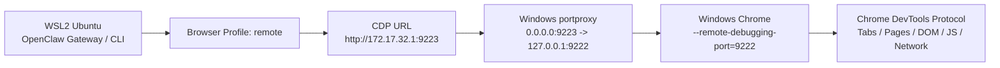
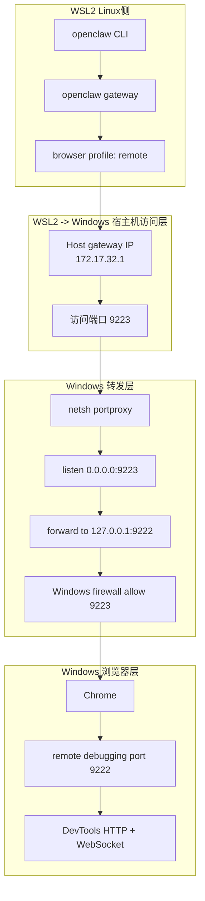
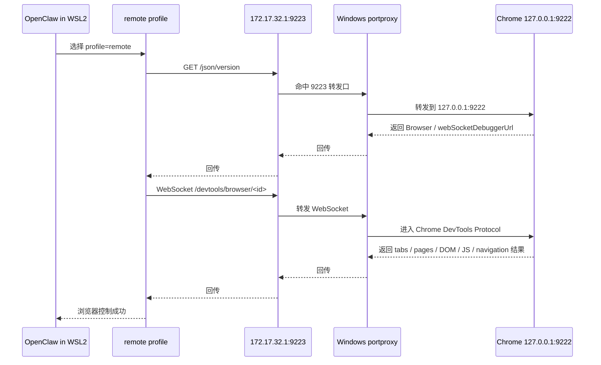

# Runbook

See the packaged executable procedure below.

---

# OpenClaw WSL2 → Windows Chrome Remote CDP Runbook（脱敏版，可执行）

## 1. 目标

本说明用于让其他维护者或 Agent **快速理解、复现并维护**如下工作链路：

- OpenClaw Gateway 运行在 **WSL2 Ubuntu** 中
- 被控制的浏览器运行在 **Windows Chrome** 中
- OpenClaw 不直接控制 Linux 本地浏览器
- OpenClaw 通过 **Remote CDP** 控制 Windows Chrome

本文强调：
- 明确配置
- 明确步骤
- 明确命令
- 明确验证点
- 明确排障顺序

## 2. 最终工作链路（一句话）

```text
OpenClaw (WSL2) -> browser profile: remote -> http://172.17.32.1:9223
-> Windows portproxy -> 127.0.0.1:9222 -> Windows Chrome (CDP)
```

关键固定点：

```text
profile = remote
cdpUrl  = http://172.17.32.1:9223
```

## 3. Mermaid 链路图



## 4. Mermaid 分层结构图



## 5. Mermaid 数据流图



## 6. 关键配置

### 6.1 OpenClaw JSON 配置片段

文件：

```text
~/.openclaw/openclaw.json
```

关键配置片段：

```json
{
  "browser": {
    "enabled": true,
    "defaultProfile": "remote",
    "profiles": {
      "remote": {
        "cdpUrl": "http://172.17.32.1:9223",
        "attachOnly": true,
        "color": "#00AA00"
      }
    }
  }
}
```

## 7. 可执行步骤（按顺序）

### Step 0：[WSL Terminal] 定位 skill 根目录

WSL 默认终端起点可能是：

```bash
pwd
```

很多情况下会看到类似：

```text
/mnt/c/Windows/system32
```

不要在这个目录直接运行 skill 脚本。先定位 skill：

```bash
find ~ -type d -name 'wsl2-windows-chrome-remote-cdp' 2>/dev/null
```

进入其中一个结果：

```bash
cd "$(find ~ -type d -name 'wsl2-windows-chrome-remote-cdp' 2>/dev/null | head -n 1)"
```

确认当前目录：

```bash
pwd
ls
```

预期至少能看到：

```text
SKILL.md
references/
scripts/
```

### Step 0.5：[WSL Terminal] 执行前置自检

在 **skill 根目录** 执行：

```bash
bash ./scripts/self-check.sh
```

说明：
- 文档默认使用 `bash ./scripts/...`，避免脚本执行位丢失时出现 `Permission denied`
- 如果你已经确认脚本有执行权限，也可以直接用 `./scripts/...`

它会检查：
- 当前目录是否真的是 skill 根目录
- `ip` / `awk` / `curl` / `jq` / `openclaw` 是否可用
- 如果缺 `jq` 等依赖，会直接打印安装命令

### Step 0.6：[WSL Terminal] 缺依赖时的推荐交互（面向小白用户）

如果前置检查发现缺依赖，不要只把安装命令丢给用户就结束。

推荐的 Agent 交互应该是：

1. 用通俗语言解释缺了什么
2. 说明这会阻塞哪一步
3. 问用户是否要代装
4. 如果用户回复 `YES`，直接执行安装
5. 安装完成后，自动继续 `self-check` 和后续恢复流程

Ubuntu / WSL 常用安装命令：

```bash
sudo apt update
sudo apt install -y jq curl iproute2
```

如果只有 `jq` 缺失，也可以更小粒度安装：

```bash
sudo apt update
sudo apt install -y jq
```

### Windows Step W0：[Windows PowerShell] 定位 skill 根目录

在 Windows PowerShell 中，先确认当前目录：

```powershell
Get-Location
```

注意：如果 skill 实际放在 WSL Linux 文件系统里，直接用下面这条命令在 Windows 用户目录下递归搜索，**通常找不到**：

```powershell
Get-ChildItem -Path $HOME -Recurse -Directory -Filter wsl2-windows-chrome-remote-cdp -ErrorAction SilentlyContinue
```

因为它只会搜 Windows 用户目录，不会自动枚举 `\\wsl$\...` 下的 Linux 文件系统。

更稳的做法：

#### 方式 A：先在 WSL 里输出 skill 路径，再切到对应的 `\\wsl$` 路径

在 **WSL Terminal** 中执行：

```bash
pwd
find ~ -type d -name 'wsl2-windows-chrome-remote-cdp' 2>/dev/null | head -n 1
```

然后在 **Windows PowerShell** 中手动进入类似这样的路径：

```powershell
Set-Location "\\wsl$\Ubuntu-24.04\home\<linux-user>\.openclaw\workspace\skills\wsl2-windows-chrome-remote-cdp"
```

#### 方式 B：如果你已经在 `\\wsl$` 里打开了 skill 目录，直接继续

进入 skill 根目录后，再确认：

```powershell
Get-Location
Get-ChildItem
```

预期至少能看到：
- `SKILL.md`
- `references`
- `scripts`

### Windows Step W0.5：[Windows PowerShell] 执行 Windows 前置自检

优先建议：**先把 Windows 侧 `.ps1` 脚本复制到 Windows 本地目录，再执行。**

原因：
- 在部分环境里，直接从 `\\wsl$\...` 路径执行 PowerShell 脚本，可能出现解析/缓存/路径兼容性异常
- 将脚本放到 Windows 本地目录（例如桌面或 `C:\temp\wsl2-windows-chrome-remote-cdp`）后再执行，更稳

例如先把下面两个文件复制到 Windows 本地目录：
- `windows-self-check.ps1`
- `setup-windows-chrome-cdp.ps1`

然后在 **已有的 Windows PowerShell 控制台** 中，`Set-Location` 到那个 Windows 本地目录，再执行：

```powershell
powershell -NoExit -ExecutionPolicy Bypass -File .\windows-self-check.ps1
```

它会检查：
- Chrome 路径是否存在
- `127.0.0.1:9222/json/version` 是否可达
- `127.0.0.1:9222/json/list` 是否可达
- `portproxy` 是否存在
- `firewall` 规则是否存在
- 最终输出 `READY` 或 `NOT READY`

这版脚本故意保持极简：
- 不做复杂对象组装
- 不做复杂格式化
- 优先保证在 Windows PowerShell 中可解析、可执行、可读输出

注意：
- 不要依赖双击 `.ps1` 文件或从 `\\wsl$` 路径直接点开脚本来观察输出
- 这类方式经常会出现“窗口瞬间打开又关闭”的体验，看起来像“闪退”
- 应在一个已经打开的 Windows PowerShell 控制台里执行，并加 `-NoExit` 保持窗口不自动关闭

### Step 1：在 Windows 启动 Chrome 调试端口 9222

```powershell
& 'C:\Program Files\Google\Chrome\Application\chrome.exe' --remote-debugging-port=9222
```

### Step 2：在 Windows 本机确认 9222 确实可用

```powershell
curl http://127.0.0.1:9222/json/version
curl http://127.0.0.1:9222/json/list
netstat -ano | findstr 9222
```

### Step 3：在 Windows 建立 9223 → 9222 的 bridge（两种方式）

#### 方式 A：手工执行 netsh（最直接）

```powershell
netsh interface portproxy add v4tov4 listenaddress=0.0.0.0 listenport=9223 connectaddress=127.0.0.1 connectport=9222
```

查看：

```powershell
netsh interface portproxy show all
```

删除：

```powershell
netsh interface portproxy delete v4tov4 listenaddress=0.0.0.0 listenport=9223
```

#### 方式 B：执行 skill 自带 PowerShell 脚本（推荐给重启后恢复）

```powershell
powershell -ExecutionPolicy Bypass -File .\scripts\setup-windows-chrome-cdp.ps1
```

这个脚本会自动：
- 启动 Chrome 9222
- 验证 `127.0.0.1:9222/json/version`
- 建立 `9223 -> 127.0.0.1:9222`
- 增加 firewall 规则

推荐顺序（在 Windows 本地目录中执行）：

```powershell
powershell -ExecutionPolicy Bypass -File .\windows-self-check.ps1
powershell -ExecutionPolicy Bypass -File .\setup-windows-chrome-cdp.ps1 -DryRun
powershell -ExecutionPolicy Bypass -File .\setup-windows-chrome-cdp.ps1
powershell -ExecutionPolicy Bypass -File .\windows-self-check.ps1
```

如果只想看 teardown 将执行什么，而不真正删除：

```powershell
powershell -ExecutionPolicy Bypass -File .\teardown-windows-chrome-cdp.ps1 -DryRun
```

### Step 4：在 Windows 放行 9223 防火墙规则

```powershell
netsh advfirewall firewall add rule name="ChromeCDP9223" dir=in action=allow protocol=TCP localport=9223
```

查看：

```powershell
netsh advfirewall firewall show rule name='ChromeCDP9223'
```

删除：

```powershell
netsh advfirewall firewall delete rule name="ChromeCDP9223"
```

如需整体回收 bridge，可执行：

```powershell
powershell -ExecutionPolicy Bypass -File .\scripts\teardown-windows-chrome-cdp.ps1
```

### Step 5：[WSL Terminal] 验证 9223 是否已打通

```bash
curl --connect-timeout 3 --max-time 5 http://172.17.32.1:9223/json/version
curl --connect-timeout 3 --max-time 5 http://172.17.32.1:9223/json/list
```

### Step 6：[WSL Terminal] 重启后自动恢复 remote CDP（推荐）

**前提：你已经完成 Step 0 和 Step 0.5，并且当前就在 skill 根目录。**

也就是说，下面这些命令都默认假设你的当前目录是：

```text
wsl2-windows-chrome-remote-cdp/
```

在这个前提下，优先使用 skill 自带脚本，而不是每次手工改 JSON：

```bash
bash ./scripts/update-openclaw-remote-cdp.sh --dry-run
bash ./scripts/update-openclaw-remote-cdp.sh --apply --set-default
```

如果你只是想快速看当前宿主机 IP 与推导出来的 CDP URL：

```bash
bash ./scripts/show-openclaw-remote-cdp.sh
```

说明：
- 文档默认使用“**在 skill 目录下执行**”这一约定
- 这样不依赖具体用户名、家目录或安装路径
- 无论 skill 被放在 `~/skills/...`、工作区目录、仓库目录，还是别的位置，只要进入 skill 根目录，命令都成立

`~/bin` 复制方式只是一种可选的长期使用优化，不是默认步骤，也不是功能前提。

### Step 7：[WSL Terminal] 确认 OpenClaw 配置已指向 remote CDP

```bash
grep -n 'defaultProfile\|cdpUrl\|attachOnly' ~/.openclaw/openclaw.json
```

### Step 8：[WSL Terminal] 重启 OpenClaw Gateway

```bash
openclaw gateway restart
```

### Step 9：[WSL Terminal] 验证 OpenClaw 已接上 remote profile

```bash
openclaw browser profiles
openclaw browser --browser-profile remote status
```

### Step 10：[WSL Terminal] 验证 OpenClaw 对 Windows Chrome 的控制能力

```bash
openclaw browser --browser-profile remote tabs
openclaw browser --browser-profile remote open https://example.com
openclaw browser --browser-profile remote snapshot
openclaw browser --browser-profile remote navigate https://example.org
```
